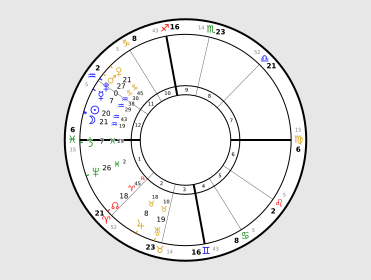
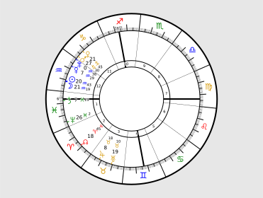

# ezAstroCharting

Easy and quick astro charting with planets and cusps information.

An SVG image will be saved to the root folder, and a chart will be displayed.

## example

### using swisseph to get the planets and cusps info

```python
from drawCharts import Charting
import swisseph as swe

# calculate universal time
# swe.set_ephe_path("E:/astrolog/ephe") # setting ephe path  fisrt is very recommended, read swisseph docs
ut = swe.julday(2024,2,10,0)

# calculate degrees of planets
degrees = []
retro = []
planets = [i for i in range(11)]
for i in planets:
xx, _ = swe.calc_ut(ut,i)
degrees.append(xx[0])
if xx[3]<0:
retro.append(i)

# calculate cusps
cusps, ascmc = swe.houses(ut,39,116)

# draw chart, with an svg and a poped-up chart
Charting(style_index=1).natal(planets,degrees,cusps,ascmc[0],ascmc[1],retro,)
```



### what about whole house?

```python
# calculate cusps
cusps_w, ascmc_w = swe.houses(ut,39,116,b'W')

# draw chart
Charting().natal(planets,degrees,cusps_w,ascmc[0],ascmc[1],retro,)
```



## others

1. Planet numbers follow the routine of [Swiss Ephemeris](https://www.astro.com/swisseph/swephprg.htm), except 11, which represent the south node.
2. Fonts other than [Astronomicon.ttf](https://astronomicon.co/en/astronomicon-fonts/) are also good to use. When no font is specified, Charting(usingFont = False), the appearance is a little less appealing.
3. The charts are made following [astro-seek](astro-seek.com), style_index = 0 and style_index = 1 represents two chart sytles in astro-seek.
4. Calculations could use libraries other than Swiss Ephemeris: [Astronomy Engine](https://github.com/cosinekitty/astronomy/tree/master/source/python) and [pyephem](https://rhodesmill.org/pyephem/) are two very good choices.
